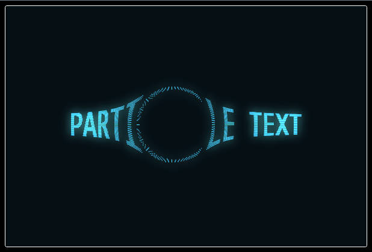

# Particle Text

Customizable Web Component that renders a canvas and animated particle text.

Canvas animations are handled in a worker thread for optimized performance.

Created from my codepen experiment [Particle Text](https://codepen.io/seanfree/pen/bGGyBYE).



## Running Locally

- Clone this repo
- `cd /path/to/particle-text`
- `nvm use $(cat .nvmrc)`
  - Or upgrade to node version listed in `.nvmrc` manually
- `npm install`
- `npm run dev`


## Local builds

- `npm run build`

## Usage

`<particle-text {...attributes}>{message?}</particle-text>`

### Using the minified code

Add a `<script>` tag to your page and copy paste the contents of `./ParticleText.min.js`:

```html
<script type="text/javascript">
  <!-- code goes here -->
</script>
```

Anywhere in your html code *after* this script, place a new `<particle-text>`:

```html
<particle-text fontSize="60">Particle Text</particle-text>
```

Modify visuals and behavior using attributes listed below.

### Default Slot

In addition to the `message` attribute, you can set a message by passing text to the default slot i.e. `<particle-text>Message Here</particle-text>`.

If both the default slot and `message` attribute are applied, the default slot content will be displayed.

### Available Attributes

Attributes are applied to `<particle-text>` as standard HTML attributes.

All attributes are applied as strings; `object` | `array` | `number` attributes are parsed by `ParticleText` before passing config to worker thread.

| Name | Type | Description | Default |
|---|---|---|---|
| `drawType` | `"fill"` \| `"stroke"` | Draw type for message. | `"stroke"` |
| `backgroundColor` | `CSS <color>` | Canvas fill color. All CSS color formats are valid.  | `"rgb(5, 15, 20)"` |
| `fontColor` | `CSS <color>` | Message color. All CSS color formats are valid. | `"rgb(60, 200, 255)"` |
| `fontFamily` | `string` | Message font-family | `"monospace"` |
| `fontSize` | `"number"` | Font size in pixels | `"40"` |
| `textAlign` | `"center"` \| `"left"` \| `"right"` \| `"start"` \| `"end"` | Message text-align | `"center"` |
| `textBaseline` | `"top"` \| `"hanging"` \| `"middle"` \| `"alphabetic"` \| `"ideographic"` \| `"bottom"` | Message baseline (vertical align) | `"middle"` |
| `message` | `string` | Message to render | `"NO MESSAGE"` |
| `density` | `"integer"` | Particle density. Values are clamped to range `1 - 4`. | `"3"` |
| `glow` | `"true"` \| `"false"` | Enables a glow effect using image compositing. Disable for better performance. | `"true"` |
| `pLerpAmt` | `"number"` | Position lerp amount. Controls reposition smoothing. Values are clamped to range `0.05 - 1`. | `"0.25"` |
| `vLerpAmt` | `"number"` | Velocity lerp amount. Controls velocity smoothing. Values are clamped to range `0.05 - 1`. | `"0.1"` |
| `mLerpAmt` | `"number"` | Mouse lerp amount. Controls mouse position smoothing. Values are clamped to range `0.05 - 1`. | `"0.5"` |
| `repelThreshold` | `"number"` | Size of mouse repel target. Values are clamped to range `20 - 200`. | `"50"` |
